<div align="center">


[](https://python.org)
[](https://docs.ultralytics.com/tasks/classify/)
[](https://opencv.org/)
[](https://roboflow.com/)

Detect whether a student is sleeping or behaving normally from a cropped image.

`Data collection` · `YOLO cropping` · `Classification` · `CSV reporting`

</div>

---

## ✨ Overview

The project contains a complete workflow for:

- Downloading and combining YOLO datasets.
- Converting source labels into `sleep` and `normal`.
- Cropping objects from YOLO bounding boxes.
- Creating train, validation, and test splits.
- Training a YOLO11 classification model.
- Running inference and exporting results to CSV.

| Class ID | Class | Description |
|:--------:|-------|-------------|
| `0` | `sleep` | Sleeping, drowsy, or head down |
| `1` | `normal` | Alert or behaving normally |

> [!IMPORTANT]
> Review automatically mapped labels before training. Data quality has a direct impact on model quality.

## ☁️ Roboflow data sources

The source registry is maintained in `configs/roboflow_sources.py`.

| # | Workspace | Project | Version |
|:-:|-----------|---------|:-------:|
| 1 | `ntthinh` | [`student-behaviour-detection-neazg-fbhsp`](https://universe.roboflow.com/ntthinh/student-behaviour-detection-neazg-fbhsp) | 1 |
| 2 | `aus-model-2` | [`student-behaviour-detection-neazg-r6kny`](https://universe.roboflow.com/aus-model-2/student-behaviour-detection-neazg-r6kny) | 1 |
| 3 | `mywork-lkwz4` | [`student-behaviour-detection-neazg`](https://universe.roboflow.com/mywork-lkwz4/student-behaviour-detection-neazg) | 1 |
| 4 | `studentclassroombehavior` | [`sleep-jgims`](https://universe.roboflow.com/studentclassroombehavior/sleep-jgims) | 1 |
| 5 | `classroomviolations` | [`detection-sleep`](https://universe.roboflow.com/classroomviolations/detection-sleep) | 1 |
| 6 | `demo-kyv3w` | [`sleeping-person-in-classroom-exmz9`](https://universe.roboflow.com/demo-kyv3w/sleeping-person-in-classroom-exmz9) | 2 |
| 7 | `student-attention-monitoring-system` | [`student-attention-monitoring`](https://universe.roboflow.com/student-attention-monitoring-system/student-attention-monitoring) | 1 |
| 8 | `suhas-yc` | [`classroom-behavior-detection-tfzpo`](https://universe.roboflow.com/suhas-yc/classroom-behavior-detection-tfzpo) | 1 |

## 🧩 Project structure

```text
sleep-classification/
├── configs/                    # Dataset source configuration
├── preprocess/                 # Downloading and preprocessing modules
├── training/                   # Model training logic
├── datasets/                   # Local datasets and generated splits
├── runs/                       # Training outputs
├── download_roboflow.py        # Download source datasets
├── crop_dataset_cls.py         # Crop YOLO bounding boxes
├── split_data.py               # Split classification data
├── train.py                    # Train the classifier
├── predict.py                  # Run inference
└── requirements.txt
```

Root-level scripts are command-line entry points. Reusable code is organized into the `configs`, `preprocess`, and `training` modules.

## ⚡ Installation

```powershell
python -m venv .venv
.\.venv\Scripts\Activate.ps1
python -m pip install --upgrade pip
pip install -r requirements.txt
```

## 🎨 Data workflow

```mermaid
flowchart LR
    A[Source data] --> B[Normalize labels]
    B --> C[Crop objects]
    C --> D[Review data]
    D --> E[Split dataset]
    E --> F[Train model]
    F --> G[Run inference]

    style A fill:#DBEAFE,stroke:#2563EB,color:#172554
    style B fill:#EDE9FE,stroke:#7C3AED,color:#2E1065
    style C fill:#FEF3C7,stroke:#D97706,color:#451A03
    style D fill:#FCE7F3,stroke:#DB2777,color:#500724
    style E fill:#CFFAFE,stroke:#0891B2,color:#083344
    style F fill:#DCFCE7,stroke:#16A34A,color:#052E16
    style G fill:#FFEDD5,stroke:#EA580C,color:#431407
```



### 1️⃣ Download data

Set the Roboflow API key in the current terminal session:

```powershell
$env:ROBOFLOW_API_KEY = "YOUR_PRIVATE_API_KEY"
python download_roboflow.py --output datasets/yolo_merged
```

Dataset sources and class aliases are configured in `configs/roboflow_sources.py`.

> [!WARNING]
> Never hard-code or commit a real API key.

### 2️⃣ Crop bounding boxes

```powershell
python crop_dataset_cls.py `
  --input datasets/yolo_merged `
  --output datasets/labelled `
  --log-file logs/crop.log
```

The command reads normalized YOLO coordinates and saves each object crop in its classification folder.

### 3️⃣ Review the data

Check for incorrect labels, corrupted images, empty crops, heavy occlusion, and near-duplicate video frames before training.

### 4️⃣ Split the dataset

```powershell
python split_data.py `
  --input datasets/labelled `
  --output datasets/dataset-v1 `
  --seed 42
```

The default ratios are 80% training, 15% validation, and 5% testing.

> [!TIP]
> Keep frames from the same video or subject in one split to reduce data leakage.

## 🧠 Training

Run with the default configuration:

```powershell
python train.py
```

Or override the main settings:

```powershell
python train.py `
  --source datasets/labelled `
  --dataset datasets/dataset-v1 `
  --model yolo11m-cls.pt `
  --epochs 200 `
  --imgsz 224 `
  --batch 32 `
  --device 0
```

Training artifacts, metrics, plots, and model weights are saved under `runs/`.

## 🔮 Inference

Predict one image:

```powershell
python predict.py input.jpg --model runs/clean_train/weights/best.pt
```

Predict a directory:

```powershell
python predict.py input_images `
  --model runs/clean_train/weights/best.pt `
  --output predictions `
  --batch 32
```

Predicted images are grouped by class, and a `predictions.csv` report is generated.

## 📊 Metrics

Focus on:

- `accuracy_top1`
- Validation loss
- Confusion matrix

With only two classes, `accuracy_top5` is always `1.0`. This is expected and is not a useful metric for this project.

## 🛠️ Common commands

```powershell
python download_roboflow.py --help
python crop_dataset_cls.py --help
python split_data.py --help
python train.py --help
python predict.py --help
```

## 🎯 Intended use

This project is intended for research and education. Evaluate the model on the target environment before using it in a real classroom system.

---

<div align="center">

### From raw images to classroom insights


</div>
