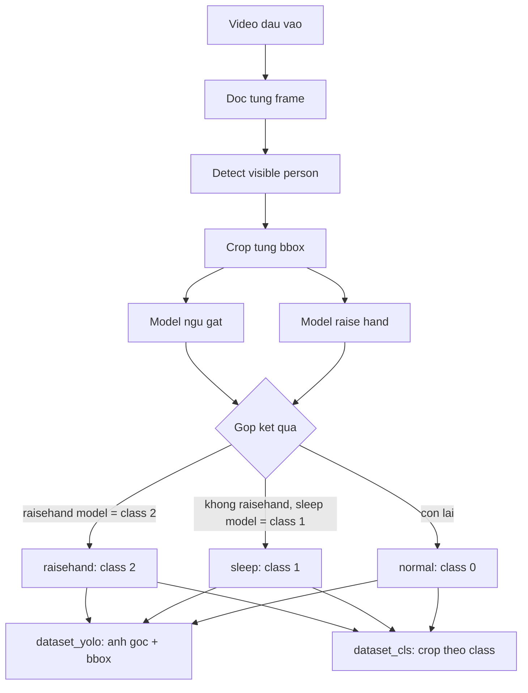

# Detect, crop, classify, and build datasets



## Output

```text
output/
  dataset_yolo/
    images/
    labels/
    data.yaml
  dataset_cls/
    normal/
    sleep/
    raisehand/
  visualize/                 # khi dung --visualize
  metadata.csv
```

`dataset_yolo/labels` dung bbox `visible person` tren anh goc voi class `0=normal`,
`1=sleep`, `2=raisehand`. Neu hai model cung duong tinh, `raisehand` duoc uu tien.

Frame video duoc dat ten theo mau `<ten_video>_<frame_index>.jpg`, vi du
`camera01_00000015.jpg`. Dung `--visualize` de luu frame co bbox va nhan du doan.

## Adaptive sampling

Dung `--adaptive-sampling` de ghep nguoi giua cac frame bang IoU va chon frame theo chu ky:

- `normal`: 5 giay
- `sleep`: 1 giay
- `raisehand`: 0.5 giay
- Nguoi moi, nhan thay doi hoac confidence duoi 0.7: luu ngay

Co the doi bang `--normal-seconds`, `--sleep-seconds`, `--raisehand-seconds`,
`--uncertain-confidence` va `--track-iou`. Ly do chon crop nam trong cot
`sample_reason` cua `metadata.csv`.

Adaptive chi quyet dinh co luu ca frame hay khong. Khi mot frame duoc chon, toan bo
nguoi, bbox va crop trong frame deu duoc luu; file YOLO khong bi thieu vat the.
